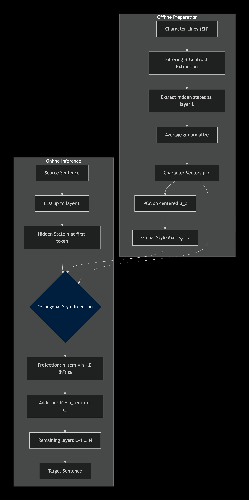
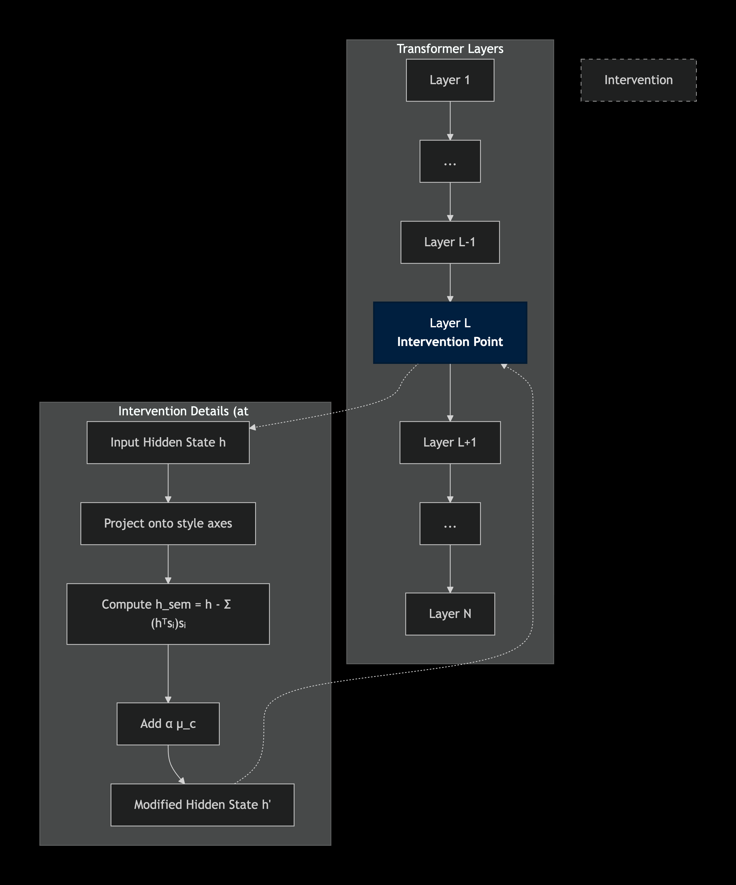

# Orthogonal Style Injection: Mechanistic Persona Steering for Zero-Shot Cross-Lingual Subtitle Translation (AACL-2026 Main)
# Where Semantic Ends, Style Starts! 


[](LICENSE)
[](https://python.org)

## Overview
Orthogonal Style Injection (OSI) enables **character-style-preserving zero-shot translation** for multilingual dialogues. 

## Problem

Modern machine translation systems excel at preserving semantic meaning but consistently fail to capture the **character‑specific speaking style**—the unique register, tone, and socio‑linguistic markers (e.g., honorifics, slang, formality) that define a character’s identity in dialogues. This stylistic flattening is particularly detrimental in creative domains such as film localization, literature, and gaming, where a character’s persona is conveyed as much through *how* they speak as through *what* they say.

Traditional approaches struggle to address this:

- **Fine‑tuning** requires large amounts of style‑annotated parallel data, which is expensive and often unavailable for low‑resource languages or individual characters.
- **Prompt‑based methods** (e.g., few‑shot, instruction prompting) are brittle, frequently leading to “instruction drift” where the model prioritizes literal translation over stylistic fidelity.
- **Simple activation steering** (e.g., adding a character vector) improves style but often degrades semantic quality because it fails to separate style from content.

---

## Solution

Orthogonal Style Injection (OSI) solves this by operating directly on the model’s latent space **at inference time, with no training**. It consists of an offline preparation phase and an online steering phase.

### Offline Preparation

1. **Representative line selection** – For each character, we use a sentence transformer to embed all English dialogue lines. The centroid of these embeddings is computed, and only the top 40% of lines (with a minimum of 10) closest to the centroid are retained. This removes noisy, atypical utterances.

2. **Character vector extraction** – The filtered lines are passed through the base LLM. At a pre‑selected layer L (typically layer 21), we extract the hidden state of the last token for each line. These vectors are averaged and normalized to obtain the character's style vector μ_c.

3. **Global style axes** – All character vectors are centered by subtracting their global mean. Principal component analysis (PCA) is then applied to the centered vectors. The first K principal components (where K explains 90% of the variance, e.g., K=9 for Qwen, K=19 for Llama) form the global style axes. These axes capture the dominant stylistic differences between characters.

### Online Steering (during decoding)

For each source sentence, the model runs normally up to layer L. At the first generated token, the hidden state h is modified in two steps:

- **Style removal (orthogonal projection)** – The component of h that lies along the global style axes is subtracted, leaving a residual h_sem that contains the semantic content.

- **Character injection** – The scaled character vector α·μ_c (with α=0.4 in our experiments) is added to the residual. The modified state h' then continues through the remaining layers, and the final translation is generated.

Because the projection removes only the global style (shared across characters) and the addition reintroduces only the target character's distinctive style, the semantic content remains intact while the output is stylistically aligned with the intended persona. The intervention is applied exactly once, preserving generation speed and fluency.

Supports multi languages, 3 movie datasets (Titanic, Avatar, Spiderman2). Baselines: vanilla, instruction, few-shot, additive.

**No training required** - pure inference steering on Qwen2.5-7B and Lama3.1-8B.

## Architecture



**Intervention**



*(Diagram: English lines/grouped by char → mean embedding → PCA null-space → steer first token)*
*Left: Offline preparation – character vectors \(\boldsymbol{\mu}_c\) and global style axes \(\mathbf{s}_k\) are computed from filtered English lines.  
Right: Online steering – at the first decoding token, the hidden state \(\mathbf{h}\) is modified by projecting out the style axes and adding the scaled character vector.*


## Project Structure
```bash
.
├── config.py              # Hyperparams & defaults
├── requirements.txt       # Dependencies
├── data/processed/        # Input CSVs
├── utils/                 # Shared utilities
│   ├── language_utils.py  # 12 langs config
│   ├── model_utils.py     # Load Qwen/Llama
│   └── filtering.py       # Centroid filter/embed
├── src/baselines/         # 4 baselines
│   ├── zero-shot.py       # Vanilla (run_vanilla)
│   ├── instruction_prompt.py
│   ├── fewshot.py         # 3-shot
│   └── additive_steering.py
├── src/osi/               # Core OSI
│   ├── build_vectors.py   # PCA/contrastive
│   └── osi_core.py        # Layer hook
├── run_baselines.py       # All baselines
├── run_osi.py            # Single lang OSI
└── run_osi_all.py        # Multi-lang OSI
```

## Data Format
CSV columns:
```
character_name, english_dialogue, bengali_dialogue, hindi_dialogue, ...
```
- `character_name`: e.g. "Jack Dawson"
- `english_dialogue`: Source line
- `*_dialogue`: Optional reference translations

**Movies**: Titanic.csv, Avatar.csv, Spiderman2.csv.

## Installation
```bash
git clone <repo>
cd Orthogonal_Style_Injection
pip install -r requirements.txt
huggingface-cli login  # Accept Qwen TOS
```

## Model Configuration (config.py)
| Param | Value | Description |
|-------|-------|-------------|
| MODEL_NAME | Qwen/Qwen2.5-7B-Instruct meta-llama/Llama-3.1-8B-Instruct| models |
| CONDITION_LAYER_IDX | 21 | Steering layer |
| ALPHA | 0.4 (default) | Steering strength |
| N_STYLE_AXES | 19 | PCA dims (90% var) |
| TOP_PERCENT | 0.4 | Filter representative lines |
| DATASETS | Avatar/Titanic/Spiderman2 | Defaults |

Override: Edit config.py or use args.

## Usage
### All Baselines
```bash
python run_baselines.py \\
  --dataset data/processed/Titanic.csv \\
  --model \"Qwen/Qwen2.5-7B-Instruct qwen\" \\
  --lang bengali hindi \\
  --output_dir outputs/baselines
```

### OSI Single Lang
```bash
python run_osi.py --language bengali --alpha 0.4 --output_dir outputs/osi
```

### OSI All Langs
```bash
python run_osi_all.py --input_csv data/processed/Titanic.csv
```

**Args** (`--help` for full):
- `--skip_*`: Skip baselines
- `--top_percent 0.4`: Filtering

## Output Format
`outputs/*/qwen/Titanic/bengali_*.csv`:
```
character,source,hypothesis,reference (optional)
"Jack Dawson","I'm the king of the world!","আমি বিশ্বের রাজা!","ground truth"
```

## Key Components
1. **OSI Core** (`src/osi/`): Layer hook applies orthogonal steering at decoding step 1.
2. **Baselines** (`src/baselines/`): Vanilla, instruction (no char name), few-shot (3 ex), additive (h + vec).
3. **Filtering** (`utils/filtering.py`): SentenceTransformer centroids → top 40% lines/char.
4. **Languages** (`utils/language_utils.py`): Indic/Euro/Asian unicode pruning.

## Supported Movies & Languages
**Movies**: Titanic, Avatar, Spiderman2.
**Languages** :
- Indic: Bengali, Hindi, Telugu, Tamil, Kannada
- Asian: Chinese, Japanese
- Euro: Italian, Spanish, German, French

## Reproducibility
Fixed seeds: None (deterministic generate: do_sample=False).
Hyperparams in config.py (layer=21 optimal for Qwen2.5, Lama3.1).

**Hyperparameters** (no training):
| OSI | Value |
|-----|-------|
| Layer | 21 |
| Axes | 19 (90% var) |
| Alpha | 0.4-0.6 |
| Filter | Top 40%, min 10 lines/char |
| Max tokens | 100 |


## License
Apache 2.0 © 
